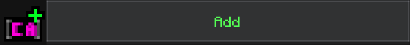

# Ranks


To navigate to the Ranks UI, go to Config UI and click "Ranks"


### Ranks in Feather

Ranks in Feather are extremely easy to configure. Click the "Add" button to get started!

<figure><figcaption></figcaption></figure>

Once you have clicked "Add" you show now see a Modal Form containing 5 fields.

* Display: What displays on the rank
* Tag: The tag to get the rank
* Bracket Color: The color of the rank's brackets
* Chat Color: The color of the chat of people who have the rank
* Name Color: The color of the name of people who have the rank

Configure these to your liking, and to get the rank do:

```
/tag @s add <tag>
```

